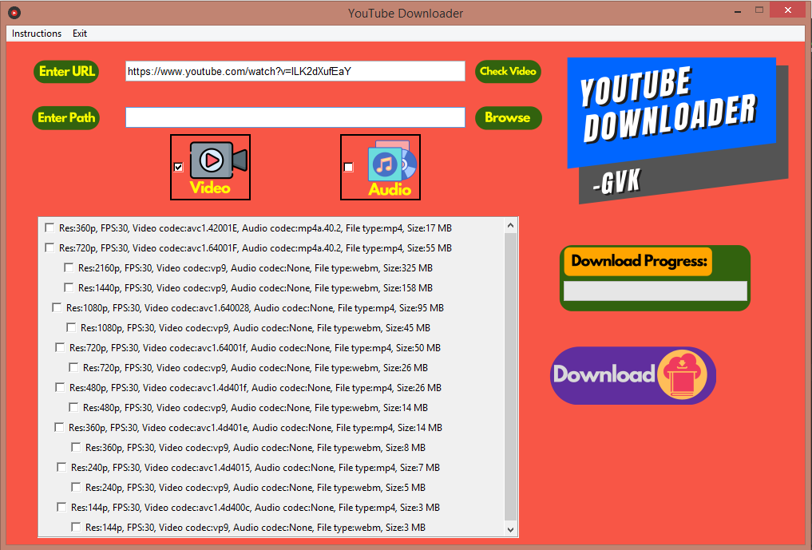

# **YouTube-Downloader**

### A simple python script that will allow you to download youtube videos.

YouTube Downloader is still maintained, but is pretty much "done".This repository contains code for a youtube-downloader GUI written in Tkinter 

## Features:
This Application has following features:

* You can Select Audio or Video to download.
* Downloads the video in various available YouTube resolutions.
* It displays the Download satistics for the Downloading video.

## Instructions:
To download any video or audio from [YouTube](https://www.youtube.com) follow these steps:
* Go to Youtube and copy the URL of the video which you wanna to download.
* Paste that URL in the **Enter URL** box, then select **Audio** or **Video**.
* Click on **Check Video** Button.
* Click on **Browse** Button to select the path of the video to be downloaded.
* Finally, click on **Download** Button to download.

## Info:
* Currently this application is only supported for Windows.

## Bugs:
This program is still in beta so if you encounter any bugs feel free to report them on https://github.com/vivek-gite/YouTube-Downloader/issues

## Note:
Some Videos might show you error because of these reasons:
1. Age Restriction
2. The creator of video has restricted to download the video from any third party software.  

## License:
This project is released under the [MIT license](LICENSE).

